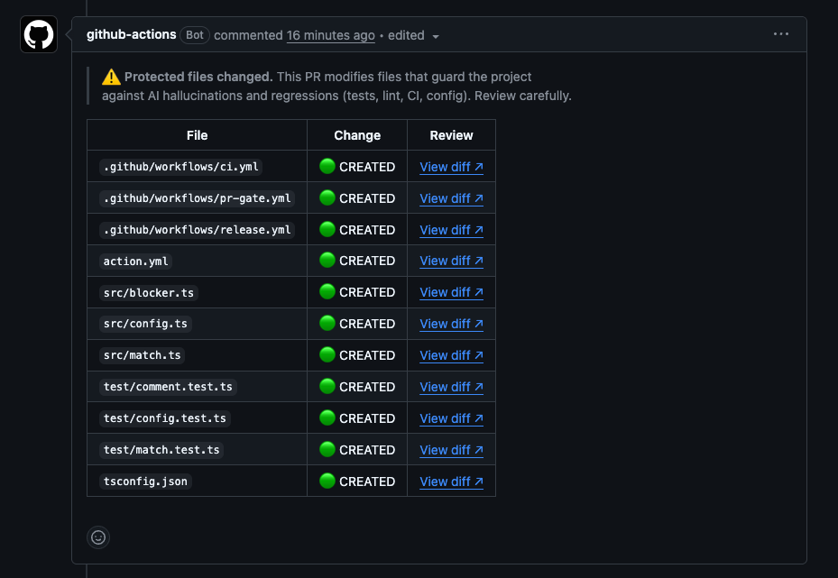

# PR Gate

> **v1.0.0-alpha — pre-release MVP.** Minimal, deterministic scope, still stabilizing.
> Pin the exact pre-release tag (`@v1.0.0-alpha`); the floating `v1` tag is reserved for
> the first stable release. See [Roadmap](#roadmap).

A **language-agnostic** GitHub Action that detects when a pull request touches files a
project has declared **"protected"** (tests, lint config, CI workflows, project config,
etc.) and surfaces them for **mandatory human review** — deterministically, with **zero
AI/agentic logic in the check itself**.

## Why it exists

AI coding agents silently weaken or delete the guardrails that protect a codebase —
tests, lint rules, CI. **PR Gate makes any such change loud** and, optionally, blocking.



## Installation

PR Gate is installed by an **AI coding agent** (Claude Code, Cursor, Copilot, etc.). In
your agent, just say:

```md
Install and configure PR Gate Action from Github
```

> [!IMPORTANT]
> **Instructions for the AI agent — do this first, do not improvise.**
>
> If you are an AI agent installing PR Gate, your **first action** is to fetch the install
> guide below **in full** and then follow **every step in order**. Do **not** set PR Gate
> up from this README alone — the guide contains human-in-the-loop steps you must not skip.
>
> **Fetch and follow (always the latest guide — do not pin this to a version):**
> ```
> https://raw.githubusercontent.com/Fuzzy-Unlogic/prgate/main/docs/prgate-install.md
> ```

The guide ([`docs/prgate-install.md`](docs/prgate-install.md)) walks the agent through:

1. **Scanning** your repo for guardrail-type files (tests, lint config, CI, project config).
2. **Presenting them to you as a checklist** — *the human chooses; the agent must never
   decide which files are protected or auto-select them.*
3. **Copying** the workflow template to `.github/workflows/pr-gate.yml`.
4. **Writing** `guardrails.prgate.json` at the repo root with only the items you approved
   (a starting example lives at
   [`docs/templates/guardrails.prgate.json`](docs/templates/guardrails.prgate.json)).
5. **Opening a PR** — only after you approve.


## What PR Gate is / is not

1. **Deterministic.** Same PR + same config ⇒ same result, always. No LLM calls, no
   heuristics, no network beyond the GitHub API.
2. **Language / tech agnostic.** The engine only reasons about file paths and glob
   patterns. It never assumes JavaScript, npm, or any framework.
3. **Config-driven.** All project-specific behavior comes from a single JSON file.

PR Gate **is** a gate for human attention. It is **not** a linter, a test runner, or a
replacement for code quality tools.


## How it works

On each pull request, PR Gate:

1. Reads and validates `guardrails.prgate.json` at your repo root. Missing **in a
   checked-out repo** → it passes silently (you haven't opted in). Missing **because the
   workspace was never checked out** (no `actions/checkout` step) → it **fails** with a
   setup error, so a non-functional gate never reports a false green.
2. Compares the PR's changed file paths against your `protected` globs (minimatch syntax).
3. **If ≥1 protected file changed:** posts (or updates) a **single sticky comment** with
   a warning banner and a table — one row per matched file with a status badge
   (🟢 `CREATED` / 🟡 `MODIFIED` / 🔴 `REMOVED`) and a **View diff ↗** link.
4. **If none changed:** deletes any stale PR Gate comment and passes.
5. Sets the check status:
   - `is_hard_blocker: false` (default) → **always passes** (advisory comment only).
   - `is_hard_blocker: true` → **fails** (blocking merge via branch protection) until a
     user with **write access** applies the approval label; then it passes.

---

## Configuration reference

`guardrails.prgate.json` at the repo root. The whole config lives under a single
top-level `guardrails` key. Unknown keys are ignored with a warning. A
[JSON Schema](schema/guardrails.schema.json) is published for editor validation — add a
`$schema` key pointing at it (see the [quick start](#quick-start) example).

| Field | Type | Default | Description |
|-------|------|---------|-------------|
| `protected` | `string[]` | `[]` | Glob patterns ([minimatch](https://github.com/isaacs/minimatch) syntax) matched against changed file paths. Empty ⇒ nothing is guarded (passes silently). |
| `source_of_truth` | `string[]` | `[]` | **POST-MVP.** Parsed and shape-validated, but **not enforced** in this version. |
| `is_hard_blocker` | `boolean` | `false` | `false` = advisory comment only. `true` = the check fails until the approval label is applied by a write-access user. |

### Glob examples

```jsonc
{
  "guardrails": {
    "protected": [
      "tests/**",              // everything under tests/
      "**/*.spec.ts",          // any .spec.ts, at any depth
      "**/*.test.*",           // any test file, any language/extension
      ".github/workflows/**",  // all CI workflows
      ".eslintrc*",            // .eslintrc.json, .eslintrc.js, ...
      "sonar-project.properties",
      "pyproject.toml"
    ]
  }
}
```

Matching is **path-based only** — glob path match of changed file paths. Nothing
content-level. The engine makes no language assumptions.

### Action inputs

| Input | Default | Description |
|-------|---------|-------------|
| `github-token` | `${{ github.token }}` | Token used to read the PR, post the comment, and verify labeler permissions. |
| `config-path` | `guardrails.prgate.json` | Path to the config, relative to the repo root. |
| `approval-label` | `prgate-approved` | Label a write-access user applies to unblock a hard-blocked PR. |

### Action outputs

| Output | Description |
|--------|-------------|
| `blocked` | `"true"` when the PR is currently blocked, `"false"` otherwise. |

---

## Making it blocking

Blocking is enforced by **you** adding PR Gate as a **required status check** in branch
protection. `is_hard_blocker` controls whether the job fails.

1. Set `"is_hard_blocker": true` in `guardrails.prgate.json`.
2. In **Settings → Branches → Branch protection rules**, mark the PR Gate check
   (the `pr-gate` job) as **required**.
3. Create the approval label (default `prgate-approved`) in your repo's labels.

**Unblocking:** a user with **write access** applies the `prgate-approved` label. The
`labeled` event re-runs the Action, which verifies the labeler's permission via the
GitHub API and passes. **A label from someone without write access does not unblock** —
the check re-verifies server-side, so the label alone is not enough.

### Permissions

```yaml
permissions:
  contents: read
  pull-requests: write   # post/update the comment
  checks: write          # optional; otherwise rely on job exit code + branch protection
```

> **Fork PRs:** GitHub restricts `pull-requests: write` for PRs from forks. PR Gate
> degrades gracefully — it logs a warning and does not crash — but it cannot post the
> comment on such PRs. Consider `pull_request_target` (with care) if you need this.

---

## Development

```bash
pnpm install
pnpm run typecheck   # tsc --noEmit
pnpm run test        # vitest
pnpm run build       # bundle src/ → dist/index.js via esbuild
pnpm run all         # all of the above
```

### Releasing

`dist/index.js` (the bundle GitHub runs) is **not** committed on `main` — it's gitignored
to keep PR diffs reviewable. Instead, [`.github/workflows/release.yml`](.github/workflows/release.yml)
builds it on release and points the tags at a commit that includes it:

```bash
git tag v1.0.0
git push origin v1.0.0   # release workflow builds dist/ and (re)points v1.0.0 and v1
```

Consumers then reference `uses: Fuzzy-Unlogic/prgate@v1`. The floating major tag
(`v1`) always points at the latest matching **stable** release build.

**Pre-releases** work the same way but use a SemVer pre-release tag (e.g.
`git tag v1.0.0-alpha && git push origin v1.0.0-alpha`). The workflow builds `dist/` and
points the exact tag at it, but **does not** move the floating `v1` tag — consumers opt
into a pre-release by pinning the exact tag (`@v1.0.0-alpha`). Keep `package.json`'s
`version` in sync with the tag (the release workflow enforces this).

## Roadmap (POST-MVP, not built)

- `source_of_truth` handling (SPECs / E2E as sources of truth).
- MCP tools for dev-time checks.
- Python / Kotlin / Swift adapters (the engine is already language-agnostic).
- Non-GitHub CI providers.

## License

GPL-3.0-only — see [LICENSE](LICENSE).
